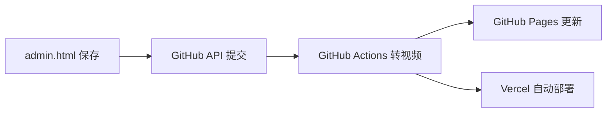

# 慢帧时光 film V2 — 手机端管理 + 导购问卷 设计文档

## 概述

在现有 V1 基础上新增两大能力：

1. **手机端管理后台** — 纯手机操作，拍照上传、编辑商品、一键发布，无需电脑
2. **AI 导购问卷** — 引导用户选择偏好，自动匹配推荐上架相机

---

## V1 → V2 架构变更

```
V1 结构:                          V2 结构:
├── index.html                    ├── index.html          (首页，增加问卷入口)
├── detail.html                   ├── detail.html         (详情页，不变)
├── css/style.css                 ├── admin.html          ✨ 管理后台（移动端优先）
├── js/cameras.js    ← 手写       ├── css/style.css       (全局样式)
├── js/main.js                    ├── js/main.js          (渲染 + 问卷 + 推荐)
└── ...                           ├── js/admin.js         ✨ 后台逻辑（表单、上传、保存）
                                  ├── data/cameras.json   ✨ 相机数据（JSON，人和机器都好读）
                                  ├── .github/workflows/  ✨ 自动转换视频格式
                                  └── ...
```

核心变化：`cameras.js` → `data/cameras.json`，新增 `admin.html` + `js/admin.js`，新增问卷页面。

---

## 一、数据层：cameras.json

### 1.1 格式

```json
[
  {
    "id": "contax-t2",
    "name": "Contax T2",
    "brand": "Contax",
    "model": "T2",
    "price": 3800,
    "condition": "9成新",
    "images": ["images/contax-t2-1.jpg"],
    "video": "videos/contax-t2.mp4",
    "accessories": ["原装镜头盖", "皮套"],
    "description": "...",

    "focalLength": "35mm",
    "cameraType": "pocket",
    "skillLevel": "intermediate",
    "bestFor": ["street", "daily", "travel"],
    "filmFormat": "35mm"
  }
]
```

### 1.2 新增标签字段

| 字段 | 类型 | 可选值 | 用于匹配 |
|------|------|--------|----------|
| `focalLength` | string | `"28mm"` `"35mm"` `"40mm"` `"50mm"` `"变焦"` ... | 焦段偏好 |
| `cameraType` | string | `"pocket"` `"slr"` `"rangefinder"` | 便携需求 |
| `skillLevel` | string | `"beginner"` `"intermediate"` `"advanced"` | 操作经验 |
| `bestFor` | string[] | `["street","portrait","travel","daily","landscape"]` | 拍摄类型 |
| `filmFormat` | string | `"35mm"` `"120"` `"110"` | 胶片格式 |

---

## 二、管理后台 admin.html

### 2.1 页面结构

```
┌──────────────────────────┐
│  慢帧时光 · 管理          │  ← 顶栏
│  [发布到网站] [预览]      │  ← 操作按钮
├──────────────────────────┤
│  ＋ 添加新相机            │  ← 大按钮
├──────────────────────────┤
│  ┌ Contax T2 ────── ✎ ✕┐│  ← 相机卡片列表
│  │ ¥3,800 · 9成新       ││     每张可编辑/删除
│  │ 3张图 · 有视频        ││
│  └──────────────────────┘│
│  ┌ Minolta X-700 ─ ✎ ✕┐│
│  │ ...                  ││
│  └──────────────────────┘│
└──────────────────────────┘
```

### 2.2 新增/编辑表单

```
┌──────────────────────────┐
│  ← 返回    编辑相机       │
├──────────────────────────┤
│  名称: [____________]    │
│  品牌: [____________]    │
│  型号: [____________]    │
│  价格: [_____] 元        │
│  成色: [▼ 9成新]         │
│                          │
│  📷 图片:                │
│  ┌───┐ ┌───┐ ┌───┐     │
│  │ 图1│ │ 图2│ │ ＋ │     │  ← 点击拍照或选图
│  └───┘ └───┘ └───┘     │
│                          │
│  🎬 视频:                │
│  [📹 cam.MOV] [换视频]   │
│                          │
│  焦段: [▼ 35mm]          │
│  机型: [▼ 口袋机]         │
│  难度: [▼ 新手友好]       │
│  适合: [✓街拍][✓日常][人像]│
│  胶片: [▼ 135]           │
│                          │
│  附件: [镜头盖,皮套...]   │
│  描述: [____________]    │
│                          │
│  [💾 保存] [🗑 删除]     │
└──────────────────────────┘
```

### 2.3 移动端优化

- 所有输入框最小高度 48px（手指好点）
- 图片上传：`<input type="file" accept="image/*" capture="environment">` — 直接调起相机
- 视频上传：`<input type="file" accept="video/*" capture="environment">` — 直接调起录像
- 表单输入框使用 `inputmode` 属性优化键盘（价格调数字键盘等）
- 所有操作按钮 100% 宽度，至少 48px 高

---

## 三、保存机制：GitHub API

### 3.1 原理

管理后台通过 GitHub Contents API 直接读写仓库文件：

```
admin.html ──fetch──▶ GitHub API
  POST /repos/{owner}/{repo}/contents/data/cameras.json
  PUT  /repos/{owner}/{repo}/contents/images/{filename}
  PUT  /repos/{owner}/{repo}/contents/videos/{filename}
```

### 3.2 GitHub Token

用户在管理后台设置一个 Personal Access Token（只给当前仓库权限），存浏览器 localStorage，后续所有操作自动带 token。

首次使用流程：
```
打开 admin.html → 弹出设置框 → 输入 GitHub Token → 保存
```

### 3.3 图片和视频上传

- 图片：FileReader 读为 base64 → GitHub API 上传（自动转 blob）
- 视频：同上，≤100MB 内直接上传
- 上传前显示进度条

### 3.4 发布按钮

点击「发布到网站」→ 提交 cameras.json 变更 → GitHub Actions 自动触发 → 转视频格式 → 部署。

---

## 四、视频自动转换：GitHub Actions

### 4.1 工作流

```yaml
# .github/workflows/convert-videos.yml
触发条件: videos/ 目录有新的 .mov 或 .MOV 文件

步骤:
  1. 检出仓库
  2. 安装 ffmpeg
  3. 扫描 videos/*.MOV → 逐个转为 *.mp4（H.264, 移动端优化）
  4. 提交 mp4 文件回仓库
  5. 触发部署
```

### 4.2 转换参数

- 编码: H.264 (libx264)，所有浏览器兼容
- 分辨率: 保持原分辨率，最大 1080p
- 码率: 2Mbps，手机浏览流畅
- 音频: AAC 128kbps

---

## 五、导购问卷

### 5.1 入口

首页顶部增加横幅卡片：「🎯 不知道选哪台？让相机找到你 →」

点击后在同页面弹出问卷（不跳转新页面），以模态/全屏面板展示。

### 5.2 问卷流程

```
Step 1: 你的预算范围是？
        ○ ¥100-300  ○ ¥300-600  ○ ¥600-1000  ○ ¥1000+

Step 2: 主要拍什么？
        ○ 街头摄影  ○ 人像  ○ 旅行记录  ○ 日常随拍  ○ 风景

Step 3: 对便携性有要求吗？
        ○ 必须口袋机，随身带  ○ 可接受单反大小  ○ 无所谓

Step 4: 偏好什么焦段？
        ○ 28mm（广角）○ 35mm（经典街拍）○ 50mm（标准）
        ○ 变焦更方便  ○ 不太懂，帮我选

Step 5: 你的胶片机经验？
        ○ 纯新手，没摸过  ○ 玩过一点  ○ 老玩家

Step 6: 有品牌偏好吗？
        ○ 无所谓  ○ Contax  ○ Olympus  ○ Minolta  ○ Canon  ○ Nikon  ○ Pentax

        ┌─────────────────────────┐
        │  🔍  查看推荐结果        │  ← 大按钮
        └─────────────────────────┘
```

### 5.3 推荐算法

纯前端匹配，无需 AI 接口：

```
每台相机初始分数 = 0

1. 价格匹配：
   - 在预算范围内: +3 分
   - 超出 ≤20%:    +1 分
   - 超出 >20%:    过滤掉

2. 拍摄类型匹配（bestFor 数组交集）:
   - 每个匹配: +2 分

3. 便携需求匹配：
   - cameraType 匹配: +2 分

4. 焦段匹配：
   - focalLength 匹配: +2 分
   - 用户选"帮我选": 此项跳过

5. 经验匹配：
   - skillLevel 匹配: +1 分

6. 品牌偏好：
   - brand 匹配: +3 分
   - 用户选"无所谓": 此项跳过

按总分降序排列，展示所有匹配的相机（≥3 分才展示）
```

### 5.4 结果展示

全屏面板，展示匹配的相机卡片（复用首页卡片样式），按分数排列，顶部标注「最推荐」「也适合你」等标签。

每张卡片可点击进入详情页。

结果页底部：「没有满意的？查看全部相机 →」跳回首页。

---

## 六、首页改动

- 顶部 Logo 下方新增导购问卷横幅卡片
- 相机列表从 `data/cameras.json` fetch 加载（替代 cameras.js）
- 支持 `?brand=xxx` URL 参数筛选（可选，预留给问卷结果用）

---

## 七、部署

### 7.1 GitHub Pages

- 仓库名：`film-camera-shop`（或用户指定）
- 开启 Pages，source 选 `main` 分支根目录
- 访问地址：`https://{username}.github.io/film-camera-shop/`

### 7.2 Vercel

- 关联同一 GitHub 仓库
- 自动检测静态站点
- 自动部署，获得 `xxx.vercel.app` 域名

### 7.3 推送即更新



---

## 八、文件清单

| 文件 | 操作 | 说明 |
|------|------|------|
| `data/cameras.json` | 新建 | 替代 cameras.js，相机数据 |
| `admin.html` | 新建 | 管理后台页面 |
| `js/admin.js` | 新建 | 后台逻辑 |
| `js/main.js` | 重写 | 加问卷、推荐、load JSON |
| `css/style.css` | 追加 | 问卷、后台、表单样式 |
| `index.html` | 修改 | 加问卷入口横幅 |
| `detail.html` | 略微修改 | js 引用路径 |
| `.github/workflows/convert.yml` | 新建 | 视频自动转换 |
| `.github/workflows/deploy.yml` | 新建 | 自动部署 |
| `js/cameras.js` | 废弃 | 数据迁移到 JSON 后可删 |
| `tools/convert-videos.sh` | 新建 | 本地一键转换脚本（备用） |

---

## 九、验证方式

1. **管理后台**：手机浏览器打开 admin.html → 添加相机 → 上传图片视频 → 保存 → 刷新首页确认出现
2. **视频转换**：上传 .MOV 文件 → 推送后 GitHub Actions 自动执行 → 检查 .mp4 已生成
3. **导购问卷**：首页点击入口 → 走完 6 步 → 看到推荐结果 → 点击进入详情
4. **部署**：GitHub Pages URL 可访问，Vercel URL 可访问
5. **移动端**：手机 Chrome/Safari/微信浏览器均可正常浏览和管理
